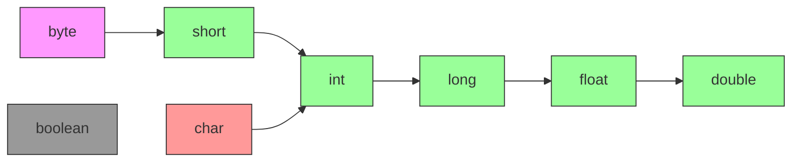

# Aula 03 - 📦 Tipos Primitivos

Os tipos primitivos são a base para manipulação de dados simples em Java. Nesta aula, exploraremos seus usos, limitações e novidades no Java 24+.

---

## 📌 **O Que São Tipos Primitivos?**
São tipos de dados **não objetos** que armazenam valores diretamente na memória. Java possui **8 tipos primitivos**:

| Tipo      | Tamanho (bits) | Valor Padrão | Exemplo          |
|-----------|----------------|--------------|------------------|
| `byte`    | 8              | 0            | `byte idade = 25;` |
| `short`   | 16             | 0            | `short codigo = 100;` |
| `int`     | 32             | 0            | `int populacao = 2_147_483_647;` |
| `long`    | 64             | 0L           | `long estrelas = 9_223_372L;` |
| `float`   | 32             | 0.0f         | `float preco = 19.99f;` |
| `double`  | 64             | 0.0d         | `double pi = 3.1415926535;` |
| `char`    | 16             | '\u0000'     | `char letra = 'A';` |
| `boolean` | 1 (aproximado) | false        | `boolean ativo = true;` |

---

## Conversão Automática



---
## 🆕 **Novidades no Java 24+**
### 1. **Underscores em Literais Numéricos**
Melhora a legibilidade de números grandes:
```java
int milhao = 1_000_000;  // Java 7+
double hexBytes = 0xFF_EC_DE_5E;  // Válido
```

### 2. **Inferência com `var` (Java 10+)**
Embora `var` não seja aplicável a tipos primitivos diretamente, funciona com literais:
```java
var numero = 10;        // int
var saldo = 1500.50;    // double
```

### 3. **Boxing/Unboxing Automático**
Conversão automática entre primitivos e wrappers (ex: `int` ↔ `Integer`):
```java
Integer codigo = 200;     // Autoboxing
int valor = codigo;       // Unboxing
```

---

## ⚠️ **Cuidados e Boas Práticas**
### 1. **Divisão Inteira**
```java
int resultado = 5 / 2;   // Resultado: 2 (não 2.5!)
```

### 2. **Precisão com `float` e `double`**
Evite comparações diretas:
```java
double a = 0.1 + 0.2;
System.out.println(a == 0.3);  // false! (0.30000000000000004)
```

### 3. **Cast Explícito**
```java
double valorDouble = 10.5;
int valorInt = (int) valorDouble;  // 10 (trunca decimais)
```

---

## 🧪 **Exemplo Prático**

```java
public class TiposPrimitivos {
    public static void main(String[] args) {
        // Declarações modernas
        var temperatura = 23.5f;      // float
        var letraUnicode = '\u0041';  // char 'A'

        // Operações
        int divisao = (int) (temperatura / 2);
        System.out.println("Divisão truncada: " + divisao); // 11

        // Autoboxing em coleções
        List<Integer> numeros = new ArrayList<>();
        numeros.add(42);  // Autoboxing de int para Integer
    }
}
```

---

## 📚 **Resumo**
- **Use `int` e `double`** para a maioria dos casos.
- **Prefira `var`** quando a inferência for clara.
- **Evite `float`** para cálculos precisos (use `BigDecimal`).
- **Atualize código legado** para usar underscores em literais grandes.

```admonition info "Dica"
Use wrappers (`Integer`, `Double`) quando precisar armazenar valores nulos ou usar coleções genéricas!
```

---

## 🔍 **Exercícios**
1. Qual o resultado de `System.out.println((10 / 3) * 3);`?  
2. Declare uma variável `long` para armazenar o número de grãos de areia na Terra (~7.5 quintilhões).  
3. Por que `0.1 + 0.2 != 0.3` em Java?
